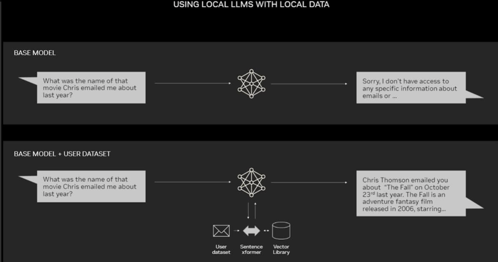
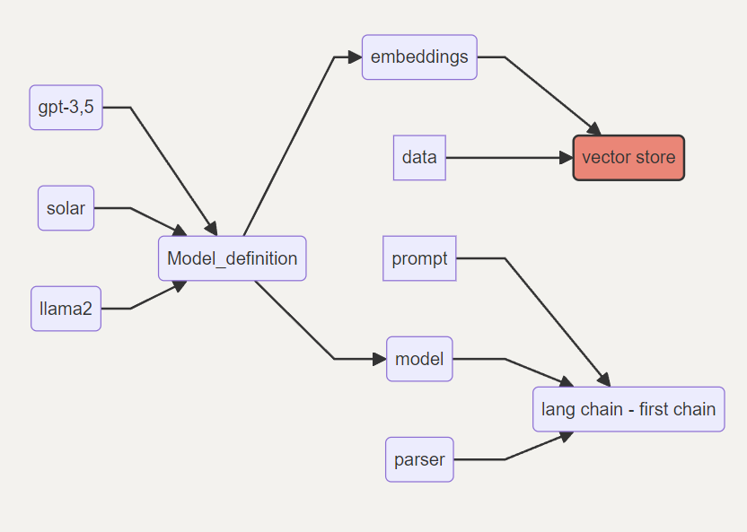
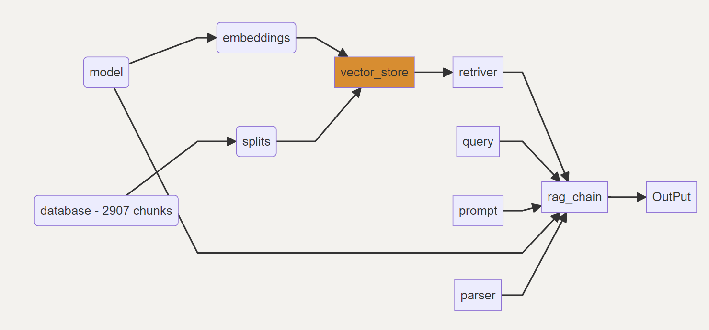
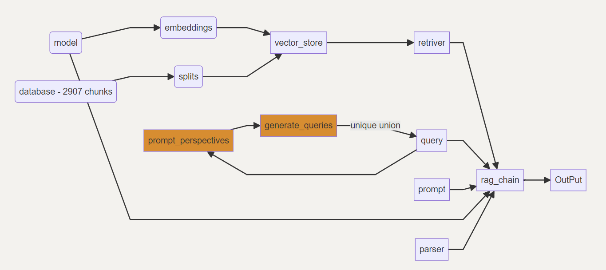

# RAG SOLUTION MOCK

1. ###### Business case:

   1. The problem is the waste of time to review a large amount of documentation looking for the answer to simple questions about specific tools.
   2. A tool is proposed that can **centralize the information and in a fluid and dynamic way answer questions about the documentation, adapting to the context that was posed**. As a business case, the KPIs that are proposed would revolve around the number of uses per individual, the ratio of correct answers and user feedback.

2. ###### Retrieval-Augmented Generation:

   1. 
   2. [What Is Retrieval-Augmented Generation, aka RAG?](https://blogs.nvidia.com/blog/what-is-retrieval-augmented-generation/) 

---

###### [Notebook1](notebook/notebook.ipynb):

- Seeks to test the usability of the models locally for a quick test
   - It is concluded that it is possible but slower, so the tests shown will be done with gpt-3.5_turbo
- A **local** vector storage solution is proposed
   - the use of a local vector storage using *DocArrayHnswSearch* is discarded and after reading the documentation it is concluded to use the vector store [chroma](https://github.com/chroma-core/chroma)
- 

## [rag_v2_1_chroma_chunk_500_naive](notebook/rag_v2_1_chroma_chunk_500_naive.ipynb)
- In this noteook a **[naive](https://www.marktechpost.com/2024/04/01/evolution-of-rags-naive-rag-advanced-rag-and-modular-rag-architectures/)** type architecture is proposed. This architecture consists of a <u>[retrival](https://python.langchain.com/docs/modules/data_connection/)</u> that integrates the **output** of the **vector store** and the **prompt** with the query structure, the direct queries and the process of processing, searching, delivering and "parsing" the output data to provide a response.
- The objective of this noteook is to review the process of data ingestion and partitioning (**chunks**), through how to manage the data in a "vector store" and consult it, how to interact with a basic prompt and how to test the model and its overall performance
- 

#### Notes

- With what I learned in **notebook1**, I decided to directly use the <u>gpt-3.5-turbo</u> model for the analysis, with a **temperature of 0** (for greater speed in development)
- Different chunk_size_splits were evaluated, which are equivalent to how many tokens will be used from each document to create the fragments to be processed to generate the embeddings. In this case 1000, 500 and 200 were used

   - In the end, the exercise with 1000 ended up using many tokens and the API reported an excess of requests per minute *(remember that my personal Openai account is being used, so the limits are more austere than in a corporate account)*. In the case of 200, although it worked, the partition into 200 tokens seemed to be very atomic for documents that on average handle more than 600 tokens, approximately 2500 characters per document; This can make it difficult to contextualize and search for correct documentation in the retriver.
   - You can check the notebook [**rag_v2_1chroma_chunk_1000_naive**](notebook/rag_v2_1_chroma_chunk_1000.ipynb) to see that a greater amount of chunk_size in this case does not improve performance

## [Multi Query Architecture v0](notebook/rag_v2_2_chroma_multi_query.ipynb)
- This notebook extends the naive RAG framework to handle multiple queries simultaneously
- This notebook involves more complex interaction with vector storage and a multi-threaded or parallel processing approach to handle multiple data streams
- 
- In conclusion, having multiple versions of a question can be beneficial when mapping the documents that will allow a more accurate answer, however, given the conditions of the current model and a naive prompt that we leave without further interaction, these benefits are not fully evident

#### [Test y concluciones (RAGAS)](notebook/test_comparison.ipynb)
- For the exercise of testing the solutions, 13 questions were asked on different topics that are covered in the documentation and a review of each question was used to provide an answer manually. The idea is to compare according to 6 indicators which is the best model for this solution.
- [**The chosen indicators from ragas**](https://docs.ragas.io/en/stable/references/metrics.html) are:
  
     - **answer_relevancy**: Relevance of the answer
     - **answer_similarity**: Semantic similarity
     - **answer_correctness**: Factual similarity
     - **context_precision**: Evaluate the precision of the retriver
     - **context_recall**: Evaluates the completeness of the retriver
     - **faithfulness**: Evaluate the given answer in factual contrast with the selected context
     - **context_entity_recall**: Evaluates the ability to use the context completely for the response
  
    - 
- There is likely a bias in the models used. For practical purposes, the 3 rags evaluated use the same model and very similar prototype prompts. They all use the same data source partition and the 13 questions were generated with the same rag model.
    
    - This is why the retriver analyzes are the same
    - It is likely that the basic multi query strategy prompt is not taking full advantage of its capabilities
    - It is likely that the fusion strategy prompt is ignoring the retrivers and is not fully exploiting their capabilities
    - Under the current conditions of the test, the best performance is given by the naive rag

---

1. Opportunities for improvement
    4.1 Migration of code to classes (main and test)
    4.2 Models
    4.3 Prompts (OOV)
    4.4 splitting and chunking

2. Next steps
    5.1 Next iteration requirements 
    5.2 Deployment requirements
    5.3 Embedding update requirements

3. #### Next steps

    1. Finish debugging the classes and main.
    2. Iterate the prompts for each case and try different chunking strategies.
    3. Provide a more complete pool of test questions and answers.
    4. Analyze the possibility of using different models on different hardware.
    5. Explore the possibility of using cloud tools for storage, processing and deployment of this tool.

