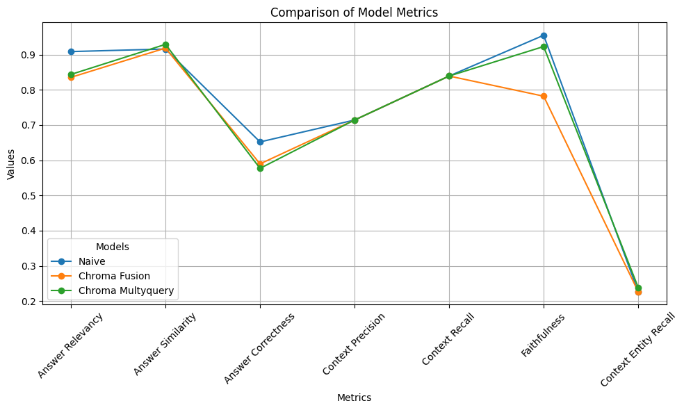

## Notebook1:

- Busca probar la usabilidad de los modelos en local para una prueba rápida
  - Se concluye que es posible pero mas lento, por lo que los test mostrados se harán con gpt-3.5_turbo
- Se plantea una solución local de vector storage
  - Se desecha y tras leer un poco la documentación se concluye usar el vector store [chroma](https://github.com/chroma-core/chroma)
- 

## rag_v2_1chroma_chunk_500_naive

- En este noteook se plantea una arquitectura tipo [naive](https://www.marktechpost.com/2024/04/01/evolution-of-rags-naive-rag-advanced-rag-and-modular-rag-architectures/), que consta de un retrival que integra la salida del vector store y el prompt con la estructura de consulta, las consultas directas y el proceso de procesamiento, búsqueda, entrega y "parseo "de datos de salida para dar una respuesta
- El objetivo de este noteook es revisar desde el proceso de ingesta de datos y partición (chunks),  pasando por la forma de gestionar los datos en un "vector store" y consultarlos, como se interactúa con un prompt básico y como se testea el modelo y su performance general

#### Paso a paso

- Con lo aprendido en **notebook1**, decidí usar directamente el modelo gpt-3.5-turbo para el análisis, con una temperatura de 0

- Se evaluaron distintos chunk_size_split, que equivalen a cuantos tokens se partirán de cada documento para crear los fragmentos a procesar para generar los embeddings. En este caso se usaron 1000, 500 y 200

  - Al final el ejercicio con 1000 terminaba usando muchos tokens y la api reportaba un exceso de solicitudes por minuto (recordar que se esta usando mi cuenta personal de openai por lo que los limites son mas austeros que en una cuenta corporativa). En el caso de 200,  si bien funcionaba, la partición en 200 tokens parecía ser muy atómica para documentos que en promedio manejan mas de 600 tokens, aproximadamente 2500 caracteres por documento; esto puede dificultar la contextualización y búsqueda de correcta documentación en el retriver.   
  - Se puede revisar el notebook **rag_v2_1chroma_chunk_1000_naive** para ver que a mayor cantidad de chunk_size en este caso no mejora el performance

- 

#### Arquitectura Multi Query v0

- Este notebook amplía el marco naive del RAG para manejar múltiples consultas simultáneamente
- Este notebook implica una interacción más compleja con el vector storage y un enfoque de procesamiento paralelo o de subprocesos múltiples para manejar múltiples flujos de datos
- 
- Como conclucion el tener multiples versiones de una pregunta puede llegar a ser beneficioso a la hora de mapear los documentos que permitiran una respuesta mas acertada, sin embargo, dadas las condiciones del modelo actual y un promt naive que dejamos sin mayor interaccion, estas bondades no se evidencian completamente

#### Test y concluciones (RAGAS)
- Para el ejercicio de testear las soluciones, se plantearon 13 preguntas sobre distintos temas que se tratan en la documentacion y se recurrio a una revision de cada pregunta para plantear una respuesta de manera manual. La idea es comparar segun 6 indicadores cual es el mejor modelo para esta solucion.
Preguntas:
    "What is SageMaker?", 
    "What are all AWS regions where SageMaker is available?",
    "How to check if an endpoint is KMS encrypted?",
    "What are SageMaker Geospatial capabilities?",
    "What is Amazon SageMaker?",
    "How does SageMaker handle model training scalability?",
    "Can SageMaker integrate with other AWS services?",
    "What are SageMaker notebooks?",
    "How does SageMaker ensure model security?",
    "What is SageMaker Autopilot?",
    "How does model monitoring work in SageMaker?",
    "What types of machine learning models can SageMaker deploy?",
    "How does SageMaker optimize model performance?",
    "Can SageMaker process real-time data for predictions?"
Respuestas:
    "SageMaker is a comprehensive AWS service that enables developers and data scientists to quickly build, train, and deploy machine learning models in the cloud.",
    "AWS regions where SageMaker is available include North America, Europe, Asia Pacific, South America, and the Middle East.",
    "To verify if an endpoint is encrypted with KMS, review the endpoints IAM policies and configurations in the AWS console or using the AWS CLI.",
    "SageMakers geospatial capabilities allow you to integrate and analyze location data to improve machine learning models, applicable in areas such as logistics and environmental analysis.",
    "Amazon SageMaker is a fully managed service that provides every developer and data scientist with the ability to build, train, and deploy machine learning models quickly.",
    "SageMaker automatically scales the training jobs by adjusting the number of instances based on the workload, ensuring efficient use of resources.",
    "Yes, SageMaker integrates seamlessly with AWS services like S3 for data storage, IAM for security, and Lambda for serverless computing, enhancing its capabilities.",
    "SageMaker notebooks are Jupyter notebooks hosted on SageMaker, enabling data scientists to prepare and process data, visualize results, and experiment with models directly.",
    "SageMaker uses AWS IAM to control access, encrypts data at rest using KMS, and data in transit using SSL to ensure secure model training and deployment.",
    "SageMaker Autopilot is an automated machine learning (AutoML) service that automatically creates, trains, and tunes the best machine learning models based on the data provided.",
    "SageMaker Model Monitor continuously tracks the models performance in production, detecting deviations in model quality to provide alerts and insights.",
    "SageMaker supports all common machine learning models, including linear regression, classification, and deep learning models like CNNs and RNNs.",
    "SageMaker optimizes models by using hyperparameter tuning to automatically find the best version of a model based on the defined criteria and metrics.",
    "Yes, SageMaker offers real-time prediction capabilities through endpoints that are scalable and can process thousands of requests per second."
Los indicadores elegidos son:
    - answer_relevancy: Relevancia de la respuesta
    - answer_similarity: Similaridad semantica
    - answer_correctness: Similaridad factual
    - context_precision: Evalua la presicion del retriver
    - context_recall: Evalua la completitud del retriver
    - faithfulness: Evalua la respuesta dada en contraste factual con el contexto seleccionado
    - context_entity_recall: Evalua la capacidad de usar el contezto completamente para la respuesta
    
- Es probable que haya un sesgo en los modelos usados. Para efectos practicos los 3 rags evaluados usan el mismo modelo y prompts prototipo muy similares. Todos usan la misma particion de fuente de datos y las 13 preguntas fueron generadas con el mismo modelo de rags.
    - Es por esto que los analisis del retriver son iguales
    - Es probable que el prompt basico de la estrategia multi query no este sacando probecho completo de sus capacidades
    - Es probable que el prompt de la estrategia fusion este obviando los retrivers y no este sacando a flote completamente sus capacidades
    - En las condiciones actuales del test el mejor performance lo da el rag naive

#### Siguientes pasos
1. Terminar de depurar las clases y el main
2. Iterar los prompts de cada caso e intentar distintas estrategias de chunk
3. Brindar un pool de preguntas y respuestas de test mas completo
4. Analizar la posibilidad de usar distintos modelos en un hardware diferente
5. Explorar la posibilidad de usar herramientas cloud para el storage, procesamiento y despliegue de esta herramienta

  

